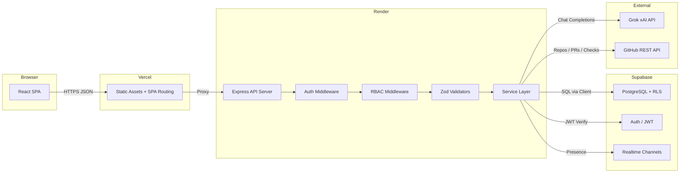

# BugForge

**A modern, developer-first bug and issue tracking platform -- a ground-up reconstruction of legacy Bugzilla for high-velocity engineering teams.**

Built with Express + TypeScript, React 18 + Vite, Tailwind CSS, Supabase (PostgreSQL, Auth, Storage, Realtime, Row Level Security), Grok AI (xAI API), and bidirectional GitHub integration.

| | |
|---|---|
| **Live Application** | [bug-forge-frontend.vercel.app](https://bug-forge-frontend.vercel.app) |
| **API Server** | [bugforge-backend.onrender.com](https://bugforge-backend.onrender.com) |
| **Repository** | [github.com/ammy194/BugForge](https://github.com/ammy194/BugForge) |
| **License** | MIT |

---

## Table of Contents

1. [Overview](#overview)
2. [What BugForge Provides](#what-bugforge-provides)
3. [Target Audience](#target-audience)
4. [Core Workflow](#core-workflow)
5. [Innovation and Differentiation](#innovation-and-differentiation)
6. [Architecture](#architecture)
7. [Detailed System Architecture](#detailed-system-architecture)
8. [Data Flow](#data-flow)
9. [Authentication Flow](#authentication-flow)
10. [AI Architecture](#ai-architecture)
11. [GitHub Integration](#github-integration)
12. [Security Architecture](#security-architecture)
13. [Threat Model](#threat-model)
14. [Tech Stack](#tech-stack)
15. [Project Structure](#project-structure)
16. [Setup and Installation](#setup-and-installation)
17. [Environment Variables](#environment-variables)
18. [Testing](#testing)
19. [Deployment](#deployment)
20. [Demo Personas](#demo-personas)
21. [Limitations](#limitations)
22. [Future Improvements](#future-improvements)
23. [License](#license)

---

## Overview

### Problem

Legacy bug trackers like Bugzilla were designed for an era of infrequent releases, manual triage, and isolated development workflows. Modern engineering teams operate with continuous delivery, automated CI/CD pipelines, and cross-functional collaboration -- yet their issue tracking tools have not kept pace.

Common pain points include:

1. **Poor bug reports** -- Insufficient reproduction steps, missing environment details, vague descriptions.
2. **Duplicate bugs** -- Multiple engineers filing identical issues wastes triage time.
3. **Manual triage** -- Human classification of severity, priority, and component assignment is slow and inconsistent.
4. **Disconnect between CI and issue tracking** -- Test failures in CI pipelines are not automatically linked to issue backlogs.
5. **Disconnect between issues and development** -- Pull requests, commits, and branches exist in a separate system with no bidirectional linkage.
6. **Difficult release visibility** -- Teams cannot quantify release readiness or identify blocking defects.
7. **Lack of team visibility** -- No realtime awareness of who is working on what.

### Solution

BugForge is a developer-first platform that replaces passive bug-filing with an active, AI-assisted issue lifecycle. It ingests CI test failures directly into the issue backlog, applies AI-powered triage and duplicate detection, enforces role-based access through a finite-state workflow engine, and surfaces quantitative release-readiness metrics.

---

## What BugForge Provides

- Full issue lifecycle management with a configurable finite-state machine (OPEN, TRIAGED, IN_PROGRESS, IN_REVIEW, RESOLVED, VERIFIED, REOPENED, CLOSED)
- AI-powered bug triage via Grok (xAI) with deterministic heuristic fallback when the API is unavailable
- Two-tier duplicate detection combining candidate narrowing with token-similarity scoring
- CI failure ingestion from GitHub Actions with one-click bug creation and commit SHA linking
- Deterministic Bug Quality Score (0-100) evaluating title clarity, reproduction steps, expected/actual behavior, and environment metadata
- Smart assignment using multi-factor heuristics: component ownership, historical resolution expertise, and workload balancing
- Release Health Radar with a mathematical readiness formula, blocker alerts, and automated release notes generation
- GitHub Activity Panel displaying PR status, review state, CI check results, and branch metadata
- Realtime collaboration with live viewer presence indicators
- Engineering telemetry including MTTD, MTTR, Bug Reopen Rate, Defect Escape Rate, and Component Health Index
- Immutable audit trail tracking role changes, data exports, authentication events, and workflow overrides
- Outbound webhook dispatch with configurable event subscriptions
- Project-scoped RBAC with four roles (Admin, Project Manager, Developer, Reporter) and hierarchical permission enforcement
- Row Level Security on all Supabase tables, matching user project membership at the database layer

---

## Target Audience

| Audience | Relevance |
|---|---|
| **Software Developers** | Keyboard-first navigation, AI triage, CI failure ingestion, GitHub integration |
| **QA Engineers** | Bug Quality Score feedback, structured reproduction fields, verification workflow |
| **Project Managers** | Release Health Radar, analytics dashboards, workload visibility |
| **Engineering Managers** | MTTD/MTTR telemetry, Component Health Index, defect escape metrics |
| **DevOps / SRE** | CI pipeline integration, webhook dispatch, audit trail |

---

## Core Workflow

The primary workflow BugForge optimizes is the complete defect lifecycle from discovery to release:

```
BUG DISCOVERED (CI failure, manual report, or log ingest)
      |
      v
REPORT BUG (structured form with progressive disclosure)
      |
      v
AI-ASSISTED TRIAGE (Grok or heuristic fallback)
      |   - Suggested severity, priority, component
      |   - Missing information checklist
      |   - Bug Quality Score (0-100)
      |
      v
DUPLICATE DETECTION (token-similarity against existing issues)
      |   - Top 3 candidates with similarity scores
      |   - Mark as duplicate, link, or proceed
      |
      v
SMART ASSIGNMENT (multi-factor recommendation)
      |   - Component ownership
      |   - Domain expertise history
      |   - Workload balancing
      |
      v
DEVELOPMENT (IN_PROGRESS -> IN_REVIEW)
      |   - GitHub PR linked
      |   - CI checks displayed inline
      |
      v
RESOLUTION (developer marks RESOLVED with resolution type)
      |
      v
QA VERIFICATION (reporter/QA verifies fix)
      |
      v
CLOSURE (PM/Admin closes ticket)
      |
      v
RELEASE HEALTH UPDATE (readiness score recalculated)
```

---

## Innovation and Differentiation

| Capability | Legacy Bugzilla | BugForge |
|---|---|---|
| CI Failure Ingestion | Manual filing | Automated test failure ingestion with one-click bug creation and git SHA linking |
| AI Bug Triage | None | Severity, priority, component suggestions with missing-information checklist via Grok; deterministic heuristic fallback |
| Duplicate Detection | Dense table search | Two-tier candidate narrowing with token overlap scoring and four resolution actions |
| Bug Quality Score | None | Deterministic 0-100 quality meter with transparent per-criterion checklist |
| Smart Assignment | Manual dropdown | Multi-factor routing: component ownership, domain expertise, workload balance |
| Release Health | Manual reports | Mathematical 0-100 readiness formula with explicit deductions per blocker, critical issue, and unverified fix |
| GitHub Integration | Manual text links | PR status badges, review state, CI checks, diff stats, linked commits |
| Realtime Collaboration | Full page reloads | Live viewer presence pills and broadcast indicators |
| Telemetry | Basic statistics | MTTD, MTTR, Bug Reopen Rate, Defect Escape Rate, Component Health Index |

### AI-Assisted Triage with Graceful Degradation

Unlike tools that require constant API connectivity, BugForge's AI system degrades to deterministic heuristics when the Grok API is unavailable. The `AIService` orchestrates between `GrokProvider` (live xAI API) and `HeuristicAIProvider` (local keyword analysis). Both providers return the same response shape, making the fallback transparent to the frontend. This dual-mode design ensures the platform remains functional in air-gapped, rate-limited, or cost-constrained environments.

### CI-to-Issue Pipeline

BugForge eliminates the manual step of copying test failure output into a bug report. CI failures are ingested with full stack traces, expected/actual results, build URLs, and commit SHAs. A single click converts any failure into a fully-linked issue with pre-populated fields.

### Deterministic Quality Scoring

The Bug Quality Score provides immediate, actionable feedback to reporters. Each scoring criterion (title clarity, description depth, reproduction steps, expected/actual behavior, environment info, component assignment, version tag) is transparently weighted and displayed as a checklist. The score is fully deterministic -- no AI randomness.

### Mathematical Release Readiness

The Release Health Radar uses a published formula: start at 100, deduct 30 per open blocker, 15 per critical issue, 20 per regression, and 5 per unverified fix. Teams can see exactly why a release scored 72 instead of 85, and which issues to resolve to improve the score.

### Workflow Integrity via FSM

The finite-state machine enforces 17 transition rules at the API layer, preventing invalid state changes regardless of how the API is called. Every transition rule specifies which roles are permitted and whether a resolution value is required. Direct transitions from CLOSED to IN_PROGRESS are explicitly forbidden -- the issue must be REOPENED first.

---

## Architecture

### High-Level System Diagram

```
                    PUBLIC USERS
                         |
                         v
                +-----------------+
                |     VERCEL      |
                | React 18 + Vite |
                |  Tailwind CSS   |
                +--------+--------+
                         | HTTPS REST (JSON)
                         v
                +-----------------+
                |     RENDER      |
                | Express + TS    |
                | Helmet, CORS    |
                | Zod Validation  |
                +--------+--------+
                         |
          +--------------+--------------+
          v              v              v
     SUPABASE          GROK          GITHUB
     PostgreSQL         AI            REST API
     Auth (JWT)        (xAI)          Webhooks
     Storage           Triage         Commits
     Realtime          Duplicates     PRs
     RLS Policies      Fallback       CI Status
```

### Component Descriptions

**Frontend (React 18 + Vite + Tailwind CSS)** -- Single-page application deployed to Vercel. Uses React Query for server state management, React Router for client-side routing, and Lucide for iconography. The frontend communicates exclusively with the backend REST API; no direct database or third-party API calls are made from the browser.

**Backend (Express + TypeScript)** -- RESTful API server deployed to Render. Structured in a layered architecture: routes define HTTP endpoints, controllers handle request/response formatting, services encapsulate business logic, middleware enforces authentication and authorization, and validators (Zod schemas) ensure input integrity. The server applies Helmet for security headers and dynamic CORS for origin validation.

**Supabase (PostgreSQL + Auth + Storage + Realtime + RLS)** -- Managed PostgreSQL database with seven applied migrations defining the schema for profiles, projects, RBAC membership, issues, issue history, comments, collaboration state, saved views, webhooks, integrations, and CI failures. Row Level Security policies enforce data isolation at the database layer.

**Grok AI (xAI API)** -- The backend integrates with Grok via the xAI chat completions API (`grok-beta` model). AI features are called exclusively from the server side. When the Grok API is unavailable or unconfigured, all AI features degrade gracefully to deterministic heuristic fallback.

**GitHub Integration** -- Bidirectional integration via the GitHub REST API and incoming webhooks. Outbound: fetches repository activity, pull request metadata, review status, and CI check results. Inbound: receives webhook payloads for push events, enabling automatic issue resolution when commit messages reference issue keys (e.g., `Fixes ECOM-1042`).

---

## Detailed System Architecture

The backend follows a strict layered architecture with clear separation of concerns:

```
HTTP Request
    |
    v
Routes (endpoint definition)
    |
    v
Auth Middleware (JWT verification, demo personas)
    |
    v
RBAC Middleware (project-scoped role enforcement)
    |
    v
Zod Validators (input schema validation)
    |
    v
Controllers (request/response formatting)
    |
    v
Services (business logic, orchestration)
    |
    +---> Data Stores (in-memory for demo, Supabase for production)
    +---> AI Providers (GrokProvider -> HeuristicAIProvider fallback)
    +---> CI Providers (GitHubActionsProvider via registry pattern)
    +---> External APIs (GitHub REST, xAI chat completions)
```

Integrations are behind service abstractions:

- `AIService` orchestrates `GrokProvider` and `HeuristicAIProvider`
- `CIIntegrationService` uses `CIProviderRegistry` with `GitHubActionsProvider`
- `GitIntegrationService` processes inbound webhooks and manages git links

---

## Data Flow



---

## Authentication Flow

1. Client sends `Authorization: Bearer <token>` header with every API request.
2. The `requireAuth` middleware checks for demo persona tokens (prefix `demo_`), Supabase JWT tokens, or local development tokens.
3. For Supabase JWTs, the middleware calls `supabase.auth.getUser(token)` to validate the session, then fetches or creates the user profile via `UserService`.
4. The authenticated user object is attached to `req.user` for downstream middleware and controllers.
5. `requireGlobalRole` middleware enforces global role restrictions (e.g., ADMIN-only endpoints).
6. `requireProjectRole` middleware checks project-scoped membership and enforces hierarchical role requirements (ADMIN > PROJECT_MANAGER > DEVELOPER > REPORTER).

---

## AI Architecture

### Provider Abstraction

```
Controller
    |
    v
AIService (orchestrator)
    |
    +--> GrokProvider.isConfigured()?
    |         |
    |    [Yes] GrokProvider.complete(prompt) --> xAI API (grok-beta)
    |         |
    |         +--> Returns parsed JSON on success
    |         +--> Returns null on failure (network, auth, malformed response)
    |
    +--> [No or null] HeuristicAIProvider.triage(title, description, components)
              |
              +--> Keyword-based severity classification
              +--> Component name matching
              +--> Label extraction from domain keywords
              +--> Missing information detection (browser, OS, repro steps)
```

The `GrokProvider` class encapsulates all xAI API communication:
- Checks `isConfigured()` before making requests (requires API key with length > 5)
- Applies `temperature: 0.1` for deterministic output
- Requests `response_format: { type: 'json_object' }` for structured responses
- Returns `null` on any failure (network timeout, HTTP error, invalid credentials)

The `HeuristicAIProvider` provides the same response shape using:
- Keyword matching for severity classification (crash/data loss -> CRITICAL, cannot/blocked -> MAJOR, typo/alignment -> TRIVIAL)
- Component name word matching against issue text
- Domain keyword extraction for suggested labels
- Missing information detection (browser, OS, file size, numbered reproduction steps)

Both providers return `AITriageResult` with identical fields, making the fallback transparent to consumers.

---

## GitHub Integration

### Outbound (BugForge -> GitHub)

The `GitIntegrationService` and `GitService` fetch:
- Repository metadata (owner, name, default branch, visibility)
- Pull request status, review state, merge status
- CI check run results (passing, failing, pending)
- Commit history with diff stats
- Branch metadata

### Inbound (GitHub -> BugForge)

Incoming push event webhooks are processed by `GitIntegrationService.processCommits()`:
1. Regex parsing of commit messages for `Fixes|Closes|Resolves|Refs <KEY>` patterns
2. Automatic git link creation (COMMIT type) on matching issues
3. Automated comment creation documenting the linked commit
4. Auto-transition to RESOLVED status for `Fixes`, `Closes`, and `Resolves` keywords

### CI Failure Ingestion

The `CIIntegrationService` uses a provider registry pattern:
1. `CIProviderRegistry` registers provider implementations (currently `GitHubActionsProvider`)
2. CI failure payloads are normalized to a common `CIFailureRecord` schema
3. One-click conversion creates a fully-linked issue with pre-populated fields, commit SHA, and build URL

---

## Security Architecture

### Security Controls Detail

| Layer | Control | Implementation |
|---|---|---|
| **Authentication** | JWT verification | Supabase `auth.getUser()` validates every token server-side |
| **Authentication** | Demo isolation | Demo tokens are recognized by prefix and never reach Supabase auth |
| **Authorization** | Global roles | `requireGlobalRole` middleware checks `req.user.global_role` against allowed roles |
| **Authorization** | Project RBAC | `requireProjectRole` middleware queries project membership and compares role rank |
| **Authorization** | Workflow guards | `WorkflowEngine` validates state transitions against the caller's role before execution |
| **Data** | Row Level Security | Seven Supabase migrations define RLS policies matching `auth.uid()` to project membership |
| **Data** | Input validation | Zod schemas validate all request bodies, query parameters, and path parameters |
| **Data** | Secret isolation | Grok API keys, GitHub tokens, and Supabase service role keys exist only in server environment variables |
| **Network** | Security headers | Helmet applies `X-Frame-Options`, `X-Content-Type-Options`, `Strict-Transport-Security`, and CSP |
| **Network** | CORS | Dynamic origin validation allows production Vercel domains, preview URLs, and localhost; unknown origins are rejected |
| **Audit** | Immutable logging | `AuditService` records role changes, exports, logins, settings updates, and transition overrides with timestamps, IP addresses, and user agents |

---

## Threat Model

| Threat | Attack Surface | Risk | Mitigation |
|---|---|---|---|
| JWT Forgery | Auth header | HIGH | Server-side verification via Supabase `auth.getUser()`; tokens validated on every request |
| Privilege Escalation | Role assignment | HIGH | RBAC middleware enforces role rank hierarchy; global ADMIN bypass is explicit and audited |
| SQL Injection | Query parameters | MEDIUM | Parameterized queries via Supabase client SDK; Zod validates all input shapes |
| Cross-Site Scripting | User-generated content | MEDIUM | React escapes output by default; Helmet sets CSP and `X-Content-Type-Options` |
| API Key Exposure | Browser network tab | HIGH | All third-party API keys (Grok, GitHub, Supabase service role) are server-side only; never included in frontend bundle |
| CSRF | State-changing endpoints | MEDIUM | Token-based auth (not cookies); CORS restricts and rejects unknown origins |
| Unauthorized Data Access | Direct database queries | HIGH | Row Level Security policies on all tables enforce project membership at the PostgreSQL level |
| Denial of Service | API endpoints | MEDIUM | Render platform provides infrastructure-level rate limiting; application-level rate limiting is not yet implemented |
| Webhook Replay | Inbound webhook endpoint | LOW | GitHub webhook secret validation (when configured); idempotent event processing |
| AI Prompt Injection | AI triage input | LOW | Grok calls use low temperature (0.1) and structured JSON response format; AI output is advisory only, never automatically applied |
| Malicious File Uploads | Supabase Storage | LOW | File upload on issues is not yet implemented in the UI; Supabase Storage policies restrict access |
| GitHub Token Compromise | Server environment | HIGH | Token stored in server environment variables only; never transmitted to the frontend |

**Honest limitations**: Application-level rate limiting is not implemented (relies on Render infrastructure). Demo persona tokens bypass authentication and should be disabled in production. The Supabase service role key has full database access and must be kept strictly server-side.

---

## Tech Stack

| Layer | Technology | Version | Purpose |
|---|---|---|---|
| **Frontend** | React | 18.3 | UI component framework |
| **Frontend** | Vite | 6.1 | Build tool and dev server |
| **Frontend** | TypeScript | 5.7 | Type safety |
| **Frontend** | Tailwind CSS | 3.4 | Utility-first styling |
| **Frontend** | React Router | 6.29 | Client-side routing |
| **Frontend** | React Query | 5.66 | Server state management and caching |
| **Frontend** | Lucide React | 0.475 | Icon library |
| **Backend** | Node.js | 18+ | Runtime environment |
| **Backend** | Express | 4.21 | HTTP server framework |
| **Backend** | TypeScript | 5.7 | Type safety |
| **Backend** | Zod | 3.24 | Schema validation |
| **Backend** | Helmet | 8.0 | Security headers |
| **Backend** | Morgan | 1.10 | HTTP request logging |
| **Database** | Supabase | 2.49 | Managed PostgreSQL, Auth, Storage, Realtime, RLS |
| **AI** | Grok (xAI) | grok-beta | AI triage and analysis |
| **CI/CD** | GitHub Actions | - | CI failure ingestion source |
| **Testing** | Vitest | 3.0 | Unit and integration testing |
| **Testing** | Supertest | 7.0 | HTTP assertion library |
| **Infra** | Vercel | - | Frontend hosting with SPA routing |
| **Infra** | Render | - | Backend hosting with health checks |
| **Infra** | Docker Compose | 3.8 | Local development containerization |

---

## Project Structure

```
BugForge/
+-- package.json                    # npm workspaces root (backend, frontend)
+-- docker-compose.yml              # Local development containers
+-- render.yaml                     # Render deployment blueprint
+-- vercel.json                     # Vercel SPA routing and build config
+-- .env.example                    # Environment variable reference
+-- LICENSE                         # MIT License
|
+-- backend/
|   +-- package.json
|   +-- tsconfig.json
|   +-- Dockerfile
|   +-- src/
|   |   +-- index.ts                # Server entry point with graceful shutdown
|   |   +-- app.ts                  # Express app factory (middleware, routes, CORS)
|   |   +-- config/
|   |   |   +-- env.ts              # Zod-validated environment configuration
|   |   +-- controllers/
|   |   |   +-- aiController.ts     # AI triage, duplicates, quality, assignment
|   |   |   +-- analyticsController.ts
|   |   |   +-- auditController.ts
|   |   |   +-- authController.ts
|   |   |   +-- collaborationController.ts
|   |   |   +-- healthController.ts
|   |   |   +-- integrationController.ts  # CI failure and GitHub webhook handling
|   |   |   +-- issueController.ts
|   |   |   +-- notificationController.ts
|   |   |   +-- projectController.ts
|   |   |   +-- releaseController.ts
|   |   |   +-- userController.ts
|   |   |   +-- viewController.ts
|   |   +-- middleware/
|   |   |   +-- authMiddleware.ts    # JWT verification, demo personas, role guards
|   |   |   +-- errorHandler.ts     # Centralized error handling (Zod, AppError, generic)
|   |   |   +-- notFoundHandler.ts  # 404 route handler
|   |   |   +-- rbacMiddleware.ts   # Project-scoped role enforcement
|   |   |   +-- requestLogger.ts    # HTTP request logging
|   |   +-- routes/
|   |   |   +-- index.ts            # Route aggregator mounting 14 sub-routers
|   |   |   +-- aiRoutes.ts
|   |   |   +-- analyticsRoutes.ts
|   |   |   +-- auditRoutes.ts
|   |   |   +-- authRoutes.ts
|   |   |   +-- ciRoutes.ts
|   |   |   +-- githubRoutes.ts
|   |   |   +-- healthRoutes.ts
|   |   |   +-- issueRoutes.ts
|   |   |   +-- notificationRoutes.ts
|   |   |   +-- projectRoutes.ts
|   |   |   +-- releaseRoutes.ts
|   |   |   +-- userRoutes.ts
|   |   |   +-- viewRoutes.ts
|   |   |   +-- webhookRoutes.ts
|   |   +-- services/
|   |   |   +-- aiService.ts         # AI orchestrator with Grok/heuristic fallback
|   |   |   +-- ai/
|   |   |   |   +-- grokProvider.ts  # xAI API client (chat completions)
|   |   |   |   +-- heuristicAIProvider.ts  # Deterministic keyword-based fallback
|   |   |   +-- analyticsService.ts  # MTTD, MTTR, reopen rate, defect escape
|   |   |   +-- auditService.ts      # Immutable audit trail
|   |   |   +-- ci/
|   |   |   |   +-- ciProvider.ts            # CI provider interface
|   |   |   |   +-- ciProviderRegistry.ts    # Provider registry pattern
|   |   |   |   +-- githubActionsProvider.ts # GitHub Actions CI implementation
|   |   |   +-- ciIntegrationService.ts      # CI failure ingestion and conversion
|   |   |   +-- commentService.ts
|   |   |   +-- duplicateDetectionService.ts
|   |   |   +-- gitIntegrationService.ts     # GitHub webhook processing, auto-resolve
|   |   |   +-- gitService.ts               # Git link CRUD
|   |   |   +-- issueService.ts             # Core issue CRUD and seed data
|   |   |   +-- notificationService.ts
|   |   |   +-- projectService.ts
|   |   |   +-- qualityScoreService.ts       # Deterministic Bug Quality Score (0-100)
|   |   |   +-- releaseHealthService.ts      # Release readiness formula
|   |   |   +-- smartAssignmentService.ts    # Multi-factor assignee recommendation
|   |   |   +-- supabase.ts                 # Supabase client initialization
|   |   |   +-- timelineService.ts
|   |   |   +-- userService.ts              # Profile CRUD and demo persona definitions
|   |   |   +-- viewService.ts
|   |   |   +-- webhookDispatcherService.ts
|   |   |   +-- workflowEngine.ts           # Finite-state machine with role guards
|   |   +-- types/                   # TypeScript interfaces and enums
|   |   |   +-- ai.ts
|   |   |   +-- analytics.ts
|   |   |   +-- auth.ts
|   |   |   +-- ci.ts
|   |   |   +-- collaboration.ts
|   |   |   +-- integration.ts
|   |   |   +-- issue.ts
|   |   |   +-- project.ts
|   |   |   +-- view.ts
|   |   +-- utils/
|   |   |   +-- apiResponse.ts       # Standardized API response formatting
|   |   |   +-- appError.ts          # Typed error classes (400, 401, 403, 404, 409, 500)
|   |   |   +-- asyncHandler.ts      # Async route wrapper
|   |   |   +-- logger.ts            # Structured logging utility
|   |   +-- validators/              # Zod request schemas
|   |       +-- authValidators.ts
|   |       +-- collaborationValidators.ts
|   |       +-- integrationValidators.ts
|   |       +-- issueValidators.ts
|   |       +-- projectValidators.ts
|   |       +-- viewValidators.ts
|   |       +-- workflowValidators.ts
|   +-- tests/
|       +-- ai.test.ts
|       +-- aiTriage.test.ts
|       +-- analytics.test.ts
|       +-- auth.test.ts
|       +-- ciProvider.test.ts
|       +-- collaboration.test.ts
|       +-- githubActivity.test.ts
|       +-- health.test.ts
|       +-- integrations.test.ts
|       +-- issues.test.ts
|       +-- metricsAndAudit.test.ts
|       +-- projects.test.ts
|       +-- qualityAndDuplicates.test.ts
|       +-- releaseHealth.test.ts
|       +-- smartAssignment.test.ts
|       +-- views.test.ts
|       +-- workflow.test.ts
|
+-- frontend/
|   +-- package.json
|   +-- tsconfig.json
|   +-- vite.config.ts
|   +-- tailwind.config.js
|   +-- postcss.config.js
|   +-- index.html
|   +-- Dockerfile
|   +-- nginx.conf
|   +-- vercel.json
|   +-- src/
|       +-- main.tsx                 # Application entry point
|       +-- App.tsx                  # Root component with routing and providers
|       +-- index.css                # Global styles and Tailwind imports
|       +-- components/
|       |   +-- auth/                # ProtectedRoute guard
|       |   +-- common/              # CommandPalette, shared UI
|       |   +-- issues/              # AITriageInspector, BugQualityMeter,
|       |   |                        # CreateIssueModal, DuplicateResolutionCard,
|       |   |                        # GitHubActivityPanel, SmartAssignmentCard,
|       |   |                        # WorkflowActionBar
|       |   +-- layout/              # AppLayout, Navbar, Sidebar, PageHeader
|       |   +-- ui/                  # Design primitives (avatar, badge, button, card, input)
|       |   +-- views/               # KanbanBoard
|       +-- contexts/
|       |   +-- AuthContext.tsx       # Authentication state and demo persona selection
|       |   +-- ProjectContext.tsx    # Active project state
|       +-- hooks/
|       |   +-- useRealtimeIssue.ts   # Supabase realtime subscription hook
|       +-- lib/
|       |   +-- api.ts               # Fetch-based API client with token injection
|       |   +-- supabase.ts          # Supabase browser client
|       |   +-- utils.ts             # Utility functions
|       +-- pages/
|       |   +-- DashboardPage.tsx
|       |   +-- IssuesPage.tsx
|       |   +-- IssueDetailPage.tsx
|       |   +-- ProjectsPage.tsx
|       |   +-- ReleasesPage.tsx
|       |   +-- ReleaseHealthPage.tsx
|       |   +-- CIFailuresPage.tsx
|       |   +-- AnalyticsPage.tsx
|       |   +-- AuditPage.tsx
|       |   +-- SettingsPage.tsx
|       |   +-- NotFoundPage.tsx
|       |   +-- auth/
|       |       +-- LoginPage.tsx
|       |       +-- RegisterPage.tsx
|       |       +-- ForgotPasswordPage.tsx
|       |       +-- ResetPasswordPage.tsx
|       +-- types/
|           +-- index.ts             # Frontend TypeScript type definitions
|
+-- supabase/
    +-- migrations/
        +-- 20260828000001_create_profiles.sql
        +-- 20260828000002_create_projects_and_rbac.sql
        +-- 20260828000003_create_issues_and_history.sql
        +-- 20260828000004_create_comments_and_collaboration.sql
        +-- 20260828000005_create_saved_views.sql
        +-- 20260828000006_create_webhooks_and_integrations.sql
        +-- 20260828000007_create_ci_failures.sql
```

---

## Setup and Installation

### Prerequisites

- Node.js v18 or later
- npm v9 or later (included with Node.js 18+)
- A Supabase project (free tier is sufficient) or use the built-in demo mode
- Optional: Docker and Docker Compose for containerized local development

### 1. Clone and Install

```bash
git clone https://github.com/ammy194/BugForge.git
cd BugForge
npm install
```

### 2. Configure Environment Variables

Copy the example environment file and populate it with your credentials:

```bash
cp .env.example .env
```

See [Environment Variables](#environment-variables) for the full reference.

### 3. Run Locally

Start both backend and frontend concurrently:

```bash
npm run dev
```

Or start them individually:

```bash
npm run dev:backend     # Express API on http://localhost:5000
npm run dev:frontend    # Vite dev server on http://localhost:5173
```

### 4. Run with Docker Compose

```bash
docker-compose up --build
```

This starts the backend on port 5000 and the frontend on port 5173.

---

## Environment Variables

**Backend variables** (set in `.env` at the repository root or in Render for production):

| Variable | Required | Description |
|---|---|---|
| `PORT` | No | Server port (default: `5000`) |
| `NODE_ENV` | No | Environment mode: `development`, `production`, or `test` |
| `CLIENT_URL` | Yes | Frontend origin for CORS (e.g., `https://bug-forge-frontend.vercel.app`) |
| `FRONTEND_URL` | No | Additional frontend origin for CORS |
| `SUPABASE_URL` | Yes | Supabase project URL |
| `SUPABASE_ANON_KEY` | Yes | Supabase anonymous (public) API key |
| `SUPABASE_SERVICE_ROLE_KEY` | Yes | Supabase service role key (server-side only, never exposed to browser) |
| `SUPABASE_JWT_SECRET` | Yes | Supabase JWT signing secret |
| `GROK_API_KEY` | No | xAI API key for Grok AI features (omit for heuristic-only mode) |
| `GROK_API_URL` | No | xAI API endpoint (default: `https://api.x.ai/v1`) |
| `GITHUB_TOKEN` | No | GitHub personal access token for repository integration |

**Frontend variables** (set in `frontend/.env` or in Vercel for production):

| Variable | Required | Description |
|---|---|---|
| `VITE_API_BASE_URL` | Yes | Backend API base URL (e.g., `http://localhost:5000/api/v1`) |
| `VITE_API_URL` | Yes | Same as `VITE_API_BASE_URL` (alias) |
| `VITE_SUPABASE_URL` | Yes | Supabase project URL |
| `VITE_SUPABASE_ANON_KEY` | Yes | Supabase anonymous (public) API key |

---

## Testing

Run the full test suite:

```bash
npm test --workspace=backend
```

**71 tests across 17 test suites** covering:

| Test Suite | Coverage Area |
|---|---|
| `auth.test.ts` | JWT verification, demo personas, role guards |
| `projects.test.ts` | CRUD, membership, components, versions |
| `issues.test.ts` | Creation, listing, filtering, state transitions |
| `workflow.test.ts` | FSM transition validation, role enforcement, resolution requirements |
| `ai.test.ts` | Triage orchestration, heuristic fallback |
| `aiTriage.test.ts` | Grok provider integration, prompt construction |
| `qualityAndDuplicates.test.ts` | Bug Quality Score calculation, duplicate detection scoring |
| `smartAssignment.test.ts` | Multi-factor assignee recommendation |
| `releaseHealth.test.ts` | Readiness score formula, release notes generation |
| `ciProvider.test.ts` | CI failure parsing, provider registry |
| `integrations.test.ts` | CI ingestion, GitHub webhook processing, outbound webhooks |
| `githubActivity.test.ts` | Repository metadata, PR status fetching |
| `collaboration.test.ts` | Realtime presence, commenting, timeline |
| `analytics.test.ts` | MTTD/MTTR calculation, component health metrics |
| `metricsAndAudit.test.ts` | Audit log recording, telemetry aggregation |
| `views.test.ts` | Saved view CRUD, filter persistence |
| `health.test.ts` | Health check endpoint, dependency status |

---

## Deployment

### Backend on Render

1. In Render, create a new **Web Service** from the `ammy194/BugForge` repository.
2. Set **Root Directory**: `backend`
3. Set **Build Command**: `npm install && npm run build`
4. Set **Start Command**: `npm start`
5. Set **Health Check Path**: `/health`
6. Add all backend environment variables.

### Frontend on Vercel

1. In Vercel, import the `ammy194/BugForge` repository.
2. Set **Framework Preset**: Vite
3. Set **Root Directory**: `frontend`
4. Set **Build Command**: `npm run build`
5. Set **Output Directory**: `dist`
6. Add frontend environment variables (`VITE_API_BASE_URL`, `VITE_SUPABASE_URL`, `VITE_SUPABASE_ANON_KEY`).

### Database on Supabase

1. Create a Supabase project.
2. Apply the seven migration files in `supabase/migrations/` via the Supabase SQL editor or CLI.
3. Copy the project URL, anon key, service role key, and JWT secret into your environment variables.

---

## Demo Personas

BugForge includes built-in personas for evaluation without Supabase authentication:

| Persona | Name | Role | Email | Token |
|---|---|---|---|---|
| Admin | Alex Martin | ADMIN | `admin@bugforge.dev` | `Bearer demo_admin` |
| Project Manager | Sarah Connor | PROJECT_MANAGER | `pm@bugforge.dev` | `Bearer demo_pm` |
| Lead Developer | Bob Chen | DEVELOPER | `bob.dev@bugforge.dev` | `Bearer demo_dev` |
| QA Reporter | Elena Rostova | REPORTER | `qa.reporter@bugforge.dev` | `Bearer demo_reporter` |

These tokens are recognized by the `requireAuth` middleware and bypass Supabase JWT verification. They are intended for demonstration and evaluation only and should be disabled in production.

---

## Limitations

The following are known limitations of the current implementation:

1. **In-memory data stores** -- The audit log, CI failure records, and some service data are stored in-memory on the backend for demonstration purposes. In a production deployment, these would be persisted to Supabase tables.
2. **Single CI provider** -- CI failure ingestion currently supports GitHub Actions only. Additional providers (GitLab CI, Jenkins, CircleCI) would require implementing the `CIProvider` interface.
3. **Token-based duplicate detection** -- Duplicate detection uses token overlap similarity rather than true vector embeddings. High-accuracy semantic matching would require a vector database or embedding API.
4. **No email notifications** -- The notification service creates in-app records but does not send email or push notifications.
5. **No file attachments on issues** -- While Supabase Storage is configured, file attachment upload on individual issues is not yet implemented in the UI.
6. **Demo persona security** -- Demo tokens bypass authentication and should be disabled or removed in a real production deployment.
7. **Single-tenant architecture** -- The current design assumes a single organization. Multi-tenancy would require schema-level isolation or organization-scoped RLS policies.
8. **No application-level rate limiting** -- Rate limiting relies on the Render hosting platform. Application-level throttling (e.g., express-rate-limit) is not yet implemented.
9. **MTTD approximation** -- Mean Time to Detection is approximated from issue creation-to-triage timestamps rather than measured from the actual moment a defect was introduced.

---

## Future Improvements

1. Persistent storage for audit logs and CI failures (migrate from in-memory to Supabase tables)
2. Additional CI provider integrations (GitLab CI, Jenkins, CircleCI) via the existing provider registry
3. Vector embedding-based duplicate detection using a dedicated embedding model
4. Email and Slack notification channels
5. File attachment support on issues via Supabase Storage
6. OAuth-based GitHub login (removing the need for manual token configuration)
7. Multi-tenancy with organization-level isolation
8. Automated end-to-end testing with Playwright
9. Application-level rate limiting via express-rate-limit
10. WebSocket-based realtime updates (replacing polling where applicable)

---


## License

This project is licensed under the MIT License. See [LICENSE](LICENSE) for details.
