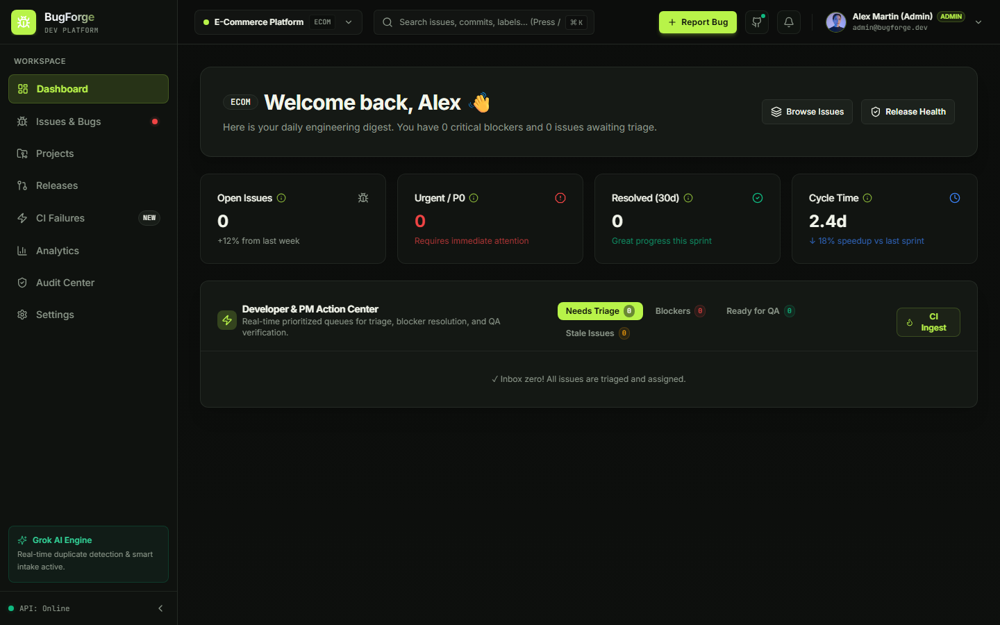
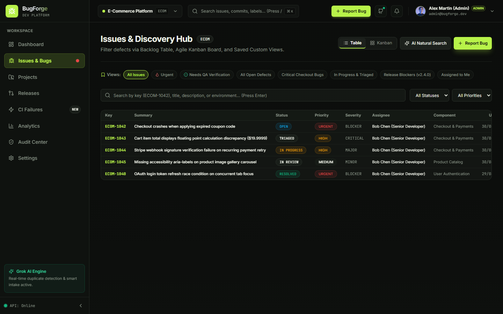
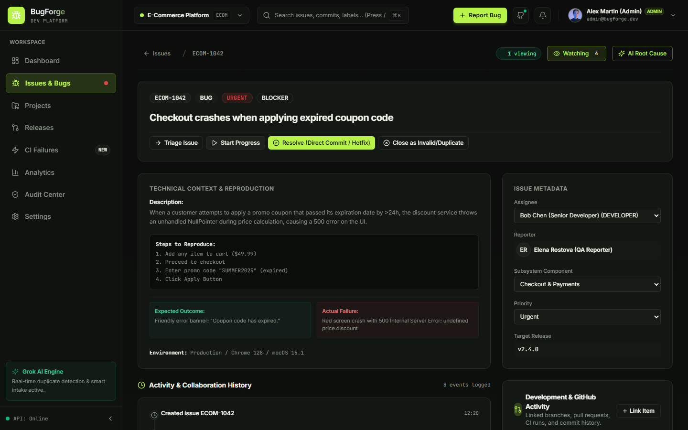
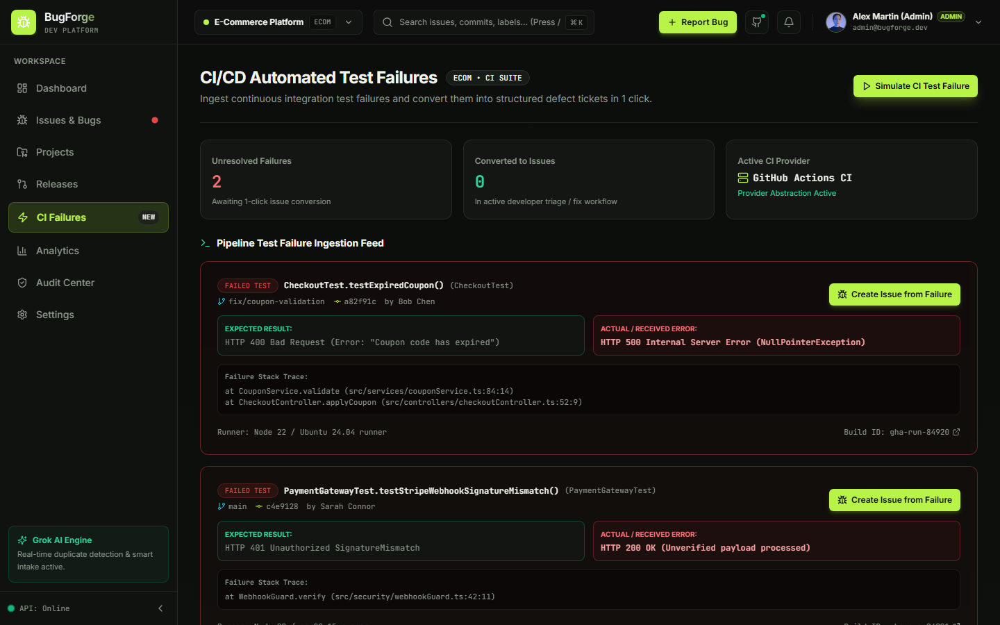
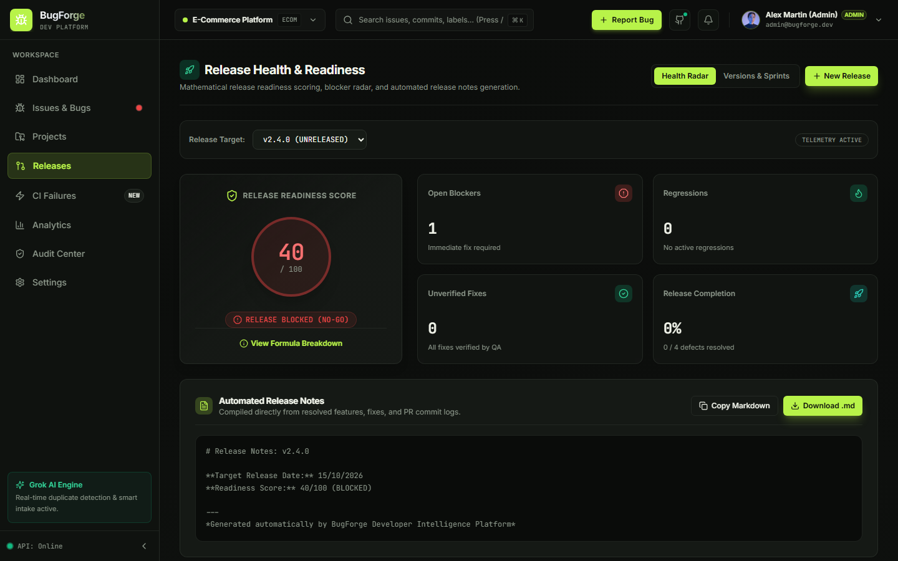
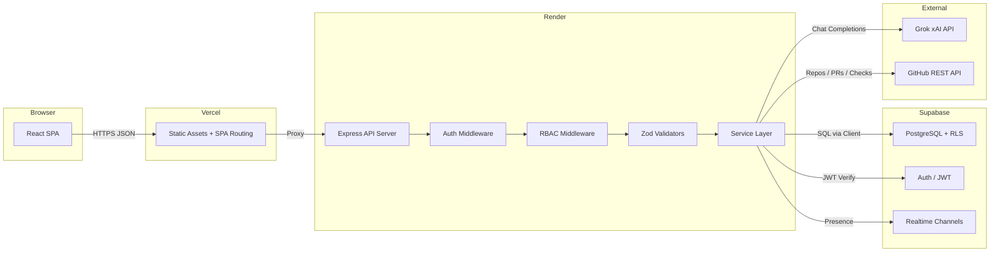

<div align="center">
  <h1>BugForge</h1>
  <p><strong>A modern, developer-first bug and issue tracking platform — a ground-up reconstruction of legacy Bugzilla for high-velocity engineering teams.</strong></p>

  <p>
    
    
    
    
    
    
  </p>

  <p>
    <a href="https://bug-forge-frontend.vercel.app"><strong>Live Application</strong></a> · 
    <a href="https://bugforge-backend.onrender.com"><strong>API Server</strong></a> · 
    <a href="https://github.com/ammy194/BugForge"><strong>Repository</strong></a>
  </p>
</div>

---

## 📌 Quick Links & Navigation

1. [What is BugForge?](#what-is-bugforge)
2. [The Problem](#the-problem)
3. [The Solution](#the-solution)
4. [Why BugForge?](#why-bugforge)
5. [Core Capabilities](#core-capabilities)
6. [End-to-End Defect Lifecycle](#end-to-end-defect-lifecycle)
7. [Product Showcase](#product-showcase)
8. [AI-Powered Engineering Intelligence](#ai-powered-engineering-intelligence)
9. [CI → Issue Automation](#ci--issue-automation)
10. [GitHub Integration](#github-integration)
11. [Release Health & Engineering Analytics](#release-health--engineering-analytics)
12. [Realtime Collaboration](#realtime-collaboration)
13. [Roles & Permissions](#roles--permissions)
14. [Security Architecture](#security-architecture)
15. [System Architecture](#system-architecture)
16. [Data Flow](#data-flow)
17. [Authentication Flow](#authentication-flow)
18. [AI Architecture](#ai-architecture)
19. [Technology Stack](#technology-stack)
20. [Project Structure](#project-structure)
21. [Setup & Installation](#setup--installation)
22. [Environment Variables](#environment-variables)
23. [Testing](#testing)
24. [Deployment](#deployment)
25. [Demo Personas](#demo-personas)
26. [Limitations](#limitations)
27. [Future Improvements](#future-improvements)
28. [License](#license)

---

## What is BugForge?

**BugForge** is a modern, developer-first platform that replaces passive bug-filing with an active, AI-assisted issue lifecycle. Built to bridge the gap between engineering workflows, CI/CD pipelines, and traditional issue management, it empowers software teams to capture, triage, and resolve defects with unprecedented velocity and clarity. 

---

## The Problem

Legacy bug trackers like Bugzilla were designed for an era of infrequent releases, manual triage, and isolated development workflows. Modern engineering teams operate with continuous delivery, automated CI/CD pipelines, and cross-functional collaboration — yet their issue tracking tools have not kept pace.

Common engineering pain points include:
- **Poor bug reports** — Insufficient reproduction steps, missing environment details, vague descriptions.
- **Duplicate bugs** — Multiple engineers filing identical issues wastes triage time.
- **Manual triage** — Human classification of severity, priority, and component assignment is slow and inconsistent.
- **Disconnect between CI and issue tracking** — Test failures in CI pipelines are not automatically linked to issue backlogs.
- **Disconnect between issues and development** — Pull requests, commits, and branches exist in a separate system with no bidirectional linkage.
- **Difficult release visibility** — Teams cannot quantify release readiness or identify blocking defects.
- **Lack of team visibility** — No realtime awareness of who is working on what.

---

## The Solution

BugForge transforms bug tracking into an intelligent, connected workflow. It automatically ingests CI test failures directly into the issue backlog, applies AI-powered triage and duplicate detection, enforces role-based access through a finite-state workflow engine, and surfaces quantitative release-readiness metrics.

---

## Why BugForge?

| Capability | Legacy Bugzilla | BugForge |
| ---------- | --------------- | -------- |
| **CI Failure Ingestion** | Manual filing | Automated test failure ingestion with one-click bug creation and git SHA linking |
| **AI Bug Triage** | None | Severity, priority, component suggestions with missing-info checklist via Grok; deterministic heuristic fallback |
| **Duplicate Detection** | Dense table search | Two-tier candidate narrowing with token overlap scoring and four resolution actions |
| **Bug Quality Score** | None | Deterministic 0-100 quality meter with transparent per-criterion checklist |
| **Smart Assignment** | Manual dropdown | Multi-factor routing: component ownership, domain expertise, workload balance |
| **Release Health** | Manual reports | Mathematical 0-100 readiness formula with explicit deductions per blocker, critical issue, and unverified fix |
| **GitHub Integration** | Manual text links | PR status badges, review state, CI checks, diff stats, linked commits |
| **Realtime Collaboration**| Full page reloads | Live viewer presence pills and broadcast indicators |
| **Telemetry** | Basic statistics | MTTD, MTTR, Bug Reopen Rate, Defect Escape Rate, Component Health Index |

### Differentiators

BugForge accelerates engineering cycles through smart automation:
- **CI Failure → Issue automation**: Seamlessly bridge the gap between testing and triage.
- **AI-assisted triage**: Automate the most tedious parts of bug management with Grok AI (xAI).
- **Two-tier duplicate detection**: Instantly surface identical issues before they clutter the backlog.
- **Deterministic Bug Quality Score**: Gamify and enforce high-quality bug reporting.
- **Smart assignment**: Let data, not guesswork, route issues to the right developer.
- **Mathematical Release Health**: Know exactly when you're ready to ship with an objective readiness score.
- **GitHub integration**: Connect issues directly to the code that fixes them.

---

## Core Capabilities

### 🧠 Intelligent Issue Management
- **Full issue lifecycle management** with a configurable finite-state machine (OPEN, TRIAGED, IN_PROGRESS, IN_REVIEW, RESOLVED, VERIFIED, REOPENED, CLOSED)
- **AI-powered bug triage** via Grok (xAI) with deterministic heuristic fallback when the API is unavailable
- **Two-tier duplicate detection** combining candidate narrowing with token-similarity scoring
- **Deterministic Bug Quality Score** (0-100) evaluating title clarity, reproduction steps, expected/actual behavior, and environment metadata
- **Smart assignment** using multi-factor heuristics: component ownership, historical resolution expertise, and workload balancing

### 💻 Developer Workflow
- **CI failure ingestion** from GitHub Actions with one-click bug creation and commit SHA linking
- **GitHub Activity Panel** displaying PR status, review state, CI check results, and branch metadata
- **Automatic issue resolution** via inbound webhook dispatch with configurable event subscriptions
- **Global Command Palette (Cmd+K)** for rapid, keyboard-first navigation and realtime issue search across the workspace
- **Rich Markdown Rendering** for technical context, crash logs, and reproduction steps in issue descriptions

### 🚀 Release Intelligence & Analytics
- **Release Health Radar** with a mathematical readiness formula, blocker alerts, and automated release notes generation
- **Engineering telemetry** including MTTD, MTTR, Bug Reopen Rate, Defect Escape Rate, and Component Health Index

### 🤝 Collaboration
- **Realtime collaboration** with live viewer presence indicators
- **Live Defect Simulation Mode** featuring an active background loop that rapidly generates synthetic incoming bugs, broadcasting live notifications to demonstrate system activity
- **Human-Readable Urgency Labels** translating internal technical priorities (e.g. `P0_CRITICAL`) into clean UI indicators (Urgent, High, Medium, Low)
- **Contextual Onboarding Tooltips** applied across KPI dashboards, analytics, and complex administrative interfaces for immediate feature clarification

### 🔒 Security & Governance
- **Project-scoped RBAC** with four roles (Admin, Project Manager, Developer, Reporter) and hierarchical permission enforcement
- **Row Level Security** on all Supabase tables, matching user project membership at the database layer
- **Immutable audit trail** tracking role changes, data exports, authentication events, and workflow overrides
- **Secure Data Exports (CSV/JSON)** for audits and telemetry powered by backend API streams to preserve authentication context and bypass popup blockers

---

## End-to-End Defect Lifecycle

The primary workflow BugForge optimizes is the complete defect lifecycle from discovery to release:

<div align="center">

**BUG DISCOVERED**  
*(CI failure, manual report, or log ingest)*  
↓  
**REPORT BUG**  
*(Structured form with progressive disclosure)*  
↓  
**AI-ASSISTED TRIAGE**  
*(Suggested severity, priority, component, and missing info checklist)*  
↓  
**DUPLICATE DETECTION**  
*(Top 3 candidates with token-similarity scores)*  
↓  
**SMART ASSIGNMENT**  
*(Multi-factor recommendation based on domain expertise and workload)*  
↓  
**DEVELOPMENT**  
*(GitHub PR linked, CI checks displayed inline)*  
↓  
**RESOLUTION**  
*(Developer marks RESOLVED with resolution type)*  
↓  
**QA VERIFICATION**  
*(Reporter/QA verifies fix)*  
↓  
**CLOSURE**  
*(PM/Admin closes ticket)*  
↓  
**RELEASE HEALTH UPDATE**  
*(Readiness score recalculated)*  

</div>

---

## Product Showcase

### 01 — Engineering Dashboard
> **Project-level engineering visibility**

<p align="center">
  
</p>

The dashboard provides a project-level overview of open issues, critical defects, workload, recent activity, and release readiness.

### 02 — Issue Management
> **Structured defect tracking and triage**

<p align="center">
  
</p>

A robust issue-management system with advanced filtering, status tracking, components, and severity indicators.

### 03 — Issue Investigation
> **Rich technical context for debugging**

<p align="center">
  
</p>

Rich issue details supporting markdown, reproduction steps, comments, and realtime viewer presence.

### 04 — Developer Workflow
> **Connecting issues with development**

<p align="center">
  
</p>

Deep integration with GitHub seamlessly connects bugs to development branches, pull requests, and CI status inline.

### 05 — QA & Verification
> **Closing the loop from fix to verification**

<p align="center">
  
</p>

Integrated QA workflows for tracking test failures, verification states, and identifying regressions.

### 06 — Release Health & Analytics
> **Release readiness backed by engineering signals**

<p align="center">
  
</p>

Quantitative release-readiness metrics, blocker alerts, and engineering analytics to ensure confident deployments.

---

## AI-Powered Engineering Intelligence

BugForge leverages the **Grok AI engine (via the xAI API)** natively to automate the most time-consuming parts of the engineering lifecycle:

- **Intelligent Bug Triage**: Grok analyzes the unstructured text of incoming bug reports to automatically recommend the correct `Severity` (e.g., Critical vs Minor) and `Priority` (P0-P4) based on context.
- **Component Routing**: By understanding technical context, Grok suggests which system component (e.g., Frontend, Database, Auth) the issue belongs to.
- **Missing Information Detection**: Grok scans the issue description and generates a checklist of missing context (e.g., "Missing browser version", "No reproduction steps provided").
- **Duplicate Detection Analysis**: Grok evaluates the semantic meaning of bug reports to identify potential duplicates even when different terminology is used.

### AI-Assisted Triage with Graceful Degradation
Unlike tools that require constant API connectivity, BugForge's AI system gracefully degrades to deterministic heuristics when the Grok API is unavailable. The `AIService` orchestrates between `GrokProvider` (live xAI API) and `HeuristicAIProvider` (local keyword analysis). Both providers return the exact same response shape, making the fallback transparent to the frontend and keeping the system functional in air-gapped or rate-limited environments.

---

## CI → Issue Automation

BugForge eliminates the manual step of copying test failure output into a bug report. The CI Integration Service uses a provider registry pattern to ingest CI failure payloads.

**Workflow:**
1. GitHub Actions failure occurs.
2. Failure payload is ingested and normalized to a common `CIFailureRecord` schema.
3. One-click bug conversion creates a fully-linked issue.
4. Pre-populated technical context includes full stack traces, expected/actual results, the build URL, and the commit SHA.

---

## GitHub Integration

BugForge features deep, bidirectional integration with GitHub:

### BugForge → GitHub (Outbound)
Fetches repository metadata, pull request status, review state, merge status, CI check run results, commit history with diff stats, and branch metadata to be displayed natively within the BugForge Issue UI.

### GitHub → BugForge (Inbound)
Incoming push event webhooks are processed by `GitIntegrationService.processCommits()`. It performs regex parsing of commit messages for `Fixes|Closes|Resolves|Refs <KEY>` patterns, automatically creating git links, adding comments documenting the linked commit, and auto-transitioning the issue to RESOLVED.

---

## Release Health & Engineering Analytics

The **Release Health Radar** provides a mathematical, objective evaluation of a project's release readiness using a deterministic formula:

- **Start at 100**
- Deduct **30** per open blocker
- Deduct **15** per critical issue
- Deduct **20** per regression
- Deduct **5** per unverified fix

Teams can see exactly why a release scored 72 instead of 85, and which explicit issues to resolve to improve the score.

---

## Realtime Collaboration

BugForge utilizes **Supabase Realtime** to offer live collaboration capabilities directly on the issue investigation view. Users can see live viewer presence indicators (pills) displaying who is actively looking at the same issue, as well as live notifications and broadcast updates.

---

## Roles & Permissions

BugForge implements a strict, hierarchical Role-Based Access Control (RBAC) system. Permissions are enforced at the API layer (backend middleware) and dynamically tailored at the UI layer to reduce clutter.

| Role | Primary Responsibilities | UI Access & Restrictions |
|---|---|---|
| **Admin** | Full workspace oversight, security audits, global settings. | Has access to all navigation tabs (including Audit Center and Settings). Can perform any state transition or delete operations. |
| **Project Manager** | Triage incoming bugs, assign workloads, track release readiness, monitor metrics. | Dashboard defaults to the "Needs Triage" queue. Has access to Analytics and Releases. Cannot access the Audit Center or CI Failures. |
| **Developer** | Fix bugs, resolve blockers, review CI failures, and link GitHub PRs. | Dashboard defaults to the "Blockers" queue. Has access to CI Failures. Cannot access Analytics, Audit Center, or Workspace Settings. |
| **Reporter / QA** | Discover and report bugs, verify fixes, and track the status of reported issues. | Dashboard uses a custom "My Reported Issues" view. Navigation is strictly limited. Cannot transition issues to "In Progress" or "Resolved", and cannot edit issue metadata after creation. |

---

## Security Architecture

| Layer | Control | Implementation |
|---|---|---|
| **Auth** | JWT verification | Supabase `auth.getUser()` validates every token server-side |
| **Auth** | Demo isolation | Demo tokens are recognized by prefix and never reach Supabase auth |
| **AuthZ** | Global roles | `requireGlobalRole` middleware checks `req.user.global_role` |
| **AuthZ** | Project RBAC | `requireProjectRole` middleware enforces hierarchical role requirements |
| **AuthZ** | Workflow guards | `WorkflowEngine` validates state transitions against the caller's role |
| **Data** | Row Level Security | Seven Supabase migrations define RLS policies matching `auth.uid()` to projects |
| **Data** | Input validation | Zod schemas validate all request bodies, query, and path parameters |
| **Data** | Secret isolation | Grok, GitHub, and Supabase service role keys exist only in server env vars |
| **Network**| Security headers | Helmet applies CSP, `X-Frame-Options`, `X-Content-Type-Options`, `HSTS` |
| **Network**| CORS | Dynamic origin validation allows verified domains and rejects unknown origins |
| **Audit** | Immutable logging | `AuditService` records role changes, exports, logins, and transition overrides |

---

## System Architecture

```text
                    PUBLIC USERS
                         |
                         v
                +-----------------+
                |     VERCEL      |
                | React 18 + Vite |
                |  Tailwind CSS   |
                +--------+--------+
                         | HTTPS REST (JSON)
                         v
                +-----------------+
                |     RENDER      |
                | Express + TS    |
                | Helmet, CORS    |
                | Zod Validation  |
                +--------+--------+
                         |
          +--------------+--------------+
          v              v              v
     SUPABASE          GROK          GITHUB
     PostgreSQL         AI            REST API
     Auth (JWT)        (xAI)          Webhooks
     Storage           Triage         Commits
     Realtime          Duplicates     PRs
     RLS Policies      Fallback       CI Status
```

---

## Data Flow



---

## Authentication Flow

1. Client sends `Authorization: Bearer <token>` header with every API request.
2. The `requireAuth` middleware checks for demo persona tokens, Supabase JWT tokens, or local development tokens.
3. For Supabase JWTs, the middleware calls `supabase.auth.getUser(token)` to validate the session, then fetches or creates the user profile via `UserService`.
4. The authenticated user object is attached to `req.user` for downstream middleware.
5. `requireGlobalRole` middleware enforces global role restrictions.
6. `requireProjectRole` middleware checks project-scoped membership and enforces hierarchical rank.

---

## AI Architecture

```text
Controller
    |
    v
AIService (orchestrator)
    |
    +--> GrokProvider.isConfigured()?
    |         |
    |    [Yes] GrokProvider.complete(prompt) --> xAI API (grok-beta)
    |         |
    |         +--> Returns parsed JSON on success
    |         +--> Returns null on failure (network, auth, malformed response)
    |
    +--> [No or null] HeuristicAIProvider.triage(title, description, components)
              |
              +--> Keyword-based severity classification
              +--> Component name matching
              +--> Label extraction from domain keywords
              +--> Missing information detection (browser, OS, repro steps)
```

---

## Technology Stack

| Layer          | Technology          | Purpose |
| -------------- | ------------------- | ------- |
| **Frontend**       | React 18, Vite      | SPA framework and build tooling |
| **Styling**        | Tailwind CSS        | Utility-first styling architecture |
| **State Management**| React Query        | Server state and API caching |
| **Backend**        | Express, TypeScript | RESTful API and core business logic |
| **Validation**     | Zod                 | End-to-end type-safe schema validation |
| **Database**       | Supabase PostgreSQL | Relational data persistence with RLS |
| **Authentication** | Supabase Auth       | Secure session and user management |
| **Realtime**       | Supabase Realtime   | Websocket subscriptions for presence |
| **AI**             | Grok (xAI API)      | Natural language processing and triage |
| **Source Control** | GitHub REST API     | CI status and pull request synchronization |
| **Testing**        | Vitest, Supertest   | Backend unit and integration test suites |
| **Deployment**     | Vercel, Render      | Infrastructure hosting |

---

## Project Structure

```text
BugForge/
+-- package.json                    # npm workspaces root (backend, frontend)
+-- docker-compose.yml              # Local development containers
+-- render.yaml                     # Render deployment blueprint
+-- vercel.json                     # Vercel SPA routing and build config
+-- .env.example                    # Environment variable reference
+-- LICENSE                         # MIT License
|
+-- backend/
|   +-- src/
|   |   +-- index.ts                # Server entry point with graceful shutdown
|   |   +-- app.ts                  # Express app factory (middleware, routes, CORS)
|   |   +-- controllers/            # Request/response formatters
|   |   +-- middleware/             # Auth, RBAC, logging, error handling
|   |   +-- routes/                 # API endpoint definitions
|   |   +-- services/               # Core business logic and providers (AI, CI, Git)
|   |   +-- types/                  # TypeScript interfaces and enums
|   |   +-- utils/                  # AppError, apiResponse, logger
|   |   +-- validators/             # Zod request schemas
|   +-- tests/                      # 17 test suites (71 tests)
|
+-- frontend/
|   +-- src/
|       +-- main.tsx                # Application entry point
|       +-- App.tsx                 # Root component with routing
|       +-- components/             # Reusable UI primitives and domain components
|       +-- contexts/               # AuthContext, ProjectContext
|       +-- hooks/                  # Custom React hooks
|       +-- lib/                    # API client, Supabase browser client
|       +-- pages/                  # Page-level components
|       +-- types/                  # Shared domain types
|
+-- supabase/
    +-- migrations/                 # 7 sequential PostgreSQL schema migrations
```

---

## Setup & Installation

### Prerequisites
- Node.js v18 or later
- npm v9 or later
- A Supabase project (free tier is sufficient) or use the built-in demo mode
- Optional: Docker and Docker Compose

### 1. Clone and Install
```bash
git clone https://github.com/ammy194/BugForge.git
cd BugForge
npm install
```

### 2. Environment Configuration
Copy the example environment file and populate it with your credentials:
```bash
cp .env.example .env
```
*(See Environment Variables section below for full reference)*

### 3. Database Setup (Supabase)
1. Create a Supabase project.
2. Apply the seven migration files in `supabase/migrations/` via the Supabase SQL editor or CLI.
3. Copy the project URL, anon key, service role key, and JWT secret into your environment variables.

### 4. Running Locally
Start both backend and frontend concurrently:
```bash
npm run dev
```
Or start them individually:
```bash
npm run dev:backend     # Express API on http://localhost:5000
npm run dev:frontend    # Vite dev server on http://localhost:5173
```

### 5. Running with Docker Compose
```bash
docker-compose up --build
```

---

## Environment Variables

**Backend variables** (set in `.env` at the repository root or in Render for production):

| Variable | Required | Description |
|---|---|---|
| `PORT` | No | Server port (default: `5000`) |
| `NODE_ENV` | No | Environment mode: `development`, `production`, or `test` |
| `CLIENT_URL` | Yes | Frontend origin for CORS |
| `FRONTEND_URL` | No | Additional frontend origin for CORS |
| `SUPABASE_URL` | Yes | Supabase project URL |
| `SUPABASE_ANON_KEY` | Yes | Supabase anonymous (public) API key |
| `SUPABASE_SERVICE_ROLE_KEY` | Yes | Supabase service role key (server-side only) |
| `SUPABASE_JWT_SECRET` | Yes | Supabase JWT signing secret |
| `GROK_API_KEY` | No | xAI API key for Grok AI features |
| `GROK_API_URL` | No | xAI API endpoint (default: `https://api.x.ai/v1`) |
| `GITHUB_TOKEN` | No | GitHub personal access token for integration |

**Frontend variables** (set in `frontend/.env` or in Vercel for production):

| Variable | Required | Description |
|---|---|---|
| `VITE_API_BASE_URL` | Yes | Backend API base URL |
| `VITE_API_URL` | Yes | Same as `VITE_API_BASE_URL` (alias) |
| `VITE_SUPABASE_URL` | Yes | Supabase project URL |
| `VITE_SUPABASE_ANON_KEY` | Yes | Supabase anonymous (public) API key |

---

## Testing

Run the full test suite from the repository root:

```bash
npm test --workspace=backend
```

Features **71 tests across 17 test suites** covering auth, RBAC guards, AI orchestration, state transitions, bug quality formulas, webhooks, and core entity CRUD.

---

## Deployment

### Backend (Render)
1. In Render, create a new **Web Service** from the repository.
2. Root Directory: `backend`
3. Build Command: `npm install && npm run build`
4. Start Command: `npm start`
5. Health Check Path: `/health`

### Frontend (Vercel)
1. In Vercel, import the repository.
2. Framework Preset: Vite
3. Root Directory: `frontend`
4. Build Command: `npm run build`
5. Output Directory: `dist`

---

## Demo Personas

BugForge includes built-in personas for evaluation without requiring Supabase authentication. These tokens bypass Supabase JWT verification and are intended for demonstration only.

| Persona | Name | Role | Email | Token |
|---|---|---|---|---|
| **Admin** | Alex Martin | ADMIN | `admin@bugforge.dev` | `Bearer demo_admin` |
| **Project Manager** | Sarah Connor | PROJECT_MANAGER | `pm@bugforge.dev` | `Bearer demo_pm` |
| **Lead Developer** | Bob Chen | DEVELOPER | `bob.dev@bugforge.dev` | `Bearer demo_dev` |
| **QA Reporter** | Elena Rostova | REPORTER | `qa.reporter@bugforge.dev` | `Bearer demo_reporter` |

---

## Limitations

1. **In-memory data stores** — The audit log, CI failure records, and some service data are stored in-memory on the backend for demonstration purposes. In a production deployment, these would be persisted to Supabase tables.
2. **Single CI provider** — CI failure ingestion currently supports GitHub Actions only.
3. **Token-based duplicate detection** — Duplicate detection uses token overlap similarity rather than true vector embeddings.
4. **No external notifications** — The notification service creates in-app records but does not currently dispatch emails or Slack messages.

---

## Future Improvements

1. Persistent storage for audit logs and CI failures.
2. Additional CI provider integrations (GitLab CI, Jenkins, CircleCI) via the existing provider registry.
3. Vector embedding-based duplicate detection using a dedicated embedding model.
4. Email and Slack notification channels.
5. File attachment support on issues via Supabase Storage.
6. OAuth-based GitHub login.

---

## License

This project is licensed under the MIT License. See [LICENSE](LICENSE) for details.
